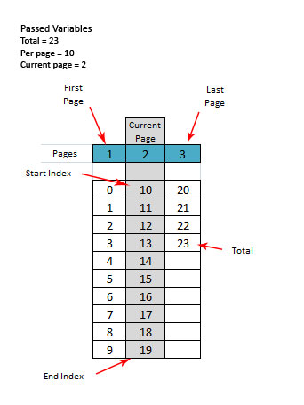

Paginator
=========

A generic PHP class to split large data into smaller chunks for use in web apps.

## Requirements

- PHP >= 5.3.3

## Installation

### Manual

* Download the zip file from the Github repository.
* Unpack the zip file and include the files in your project.
* Include the class in /src/:

```php
require_once '/path/to/src/Kosinix/Paginator.php'; // Change this to the correct path
```

### Composer

Inside your project directory, open the command line and type:

```php
composer require kosinix/paginator:dev-master --prefer-dist
```

Include the autoload.php found in vendor/:

```php
require_once '/path/to/vendor/autoload.php'; // Change this to the correct path
```

## Usage
Include the class and pass the required parameters

```php
require_once 'src/Kosinix/Paginator.php';

$total = 23; // This will come from your app. Eg. do an SQL count: 'SELECT COUNT(*) AS `total` FROM user'
$current_page = 2; // This will come from your app. Eg. $current_page = $_GET['page'];
$per_page = 10; // This will also come from your app. 

$paginator = new \Kosinix\Paginator($total, $current_page, $per_page);

$sql = sprintf('SELECT * FROM users LIMIT %d,%d', $paginator->getStartIndex(), $paginator->getPerPage());

// Run sql query here
```


The constructor accepts the following parameters:

- **total** - The total number of records.
- **current_page** - The current page to display. Defaults to 1.
- **per_page** - The number of records in a page. Defaults to 10. 

Terms are best explained by this image



## Silex Service Provider

You can also create a service provider for paginator for use in Silex:

```php
// PaginatorServiceProvider.php

use Silex\Application;
use Silex\ServiceProviderInterface;
use Kosinix\Paginator;

class PaginatorServiceProvider implements ServiceProviderInterface {

    public function register(Application $app) {
        $app['paginator.per_page'] = isset($app['paginator.per_page']) ? (int)$app['paginator.per_page'] : 10;
        $app['paginator'] = $app->protect(
            function ($total, $page, $per_page=null) use ($app) {
                if(null === $per_page){
                    $per_page = $app['paginator.per_page'];
                }
                return new Paginator($total, $page, $per_page);
            }
        );
    }

    public function boot(Application $app) {

    }
}
```

Then in your app:

```php
// Paginator
$app->register(new PaginatorServiceProvider());
```

In your controller:
```php
$sql = 'SELECT COUNT(*) AS `total` FROM product';
$count = $app['db']->fetchAssoc($sql);
$count = (int) $count['total'];

/** @var \Kosinix\Paginator $paginator */
$paginator =  $app['paginator']($count, $page); // $page would come from your web app
```

## Test

- Go to the project folder and run phpunit in the command line.
- You need to have phpunit installed globally.

## License

- MIT

