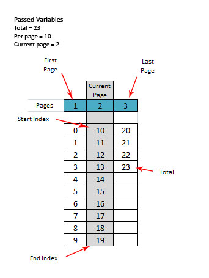

Paginator
=========

PHP class to split large data into smaller chunks for use in web apps

## Requirements

- PHP >= 5.3.3

## Usage
Include the class

```php
require_once 'src/Kosinix/Paginator.php';

$total = 100; // This will come from your app. Eg. do an SQL count: 'SELECT COUNT(*) AS `total` FROM user'
$current_page = 1 // This will come from your app. Eg. $current_page = $_GET['page'];

$paginator = new \Kosinix\Paginator($total, $current_page);

$sql = sprintf('SELECT * FROM users LIMIT %d,%d', $paginator->get_start_index(), $paginator->get_per_page());

// Run sql query here
```

## Test

- Go to the project folder and run phpunit in the command line.
- You need to have phpunit installed globally.

## License
MIT

## Doc
Terms are best explained by this image

